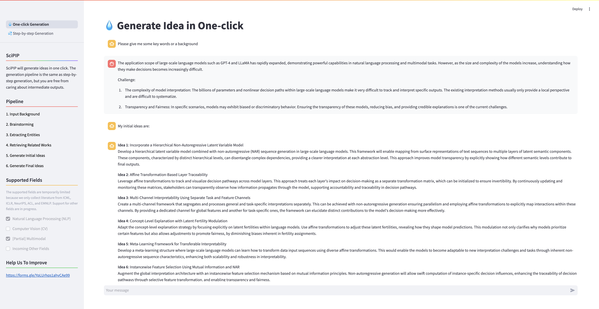

<center><h1> 💡SciPIP: An LLM-based Scientific Paper Idea Proposer </h1></center>

<div align="center">
  <p>
      <a href="https://github.com/cheerss/SciPIP/issues">
          
      </a>
      <a href="LICENSE">
          
      </a>
      <a href="https://arxiv.org/abs/2410.23166">
          
      </a>
      
      =3.10.3-blue" alt="Python version">
  </p>
</div>


## Introduction

SciPIP is a scientific paper idea generation tool powered by a large language model (LLM) designed to **assist researchers in quickly generating novel research ideas**. Based on the background information provided by the user, SciPIP first conducts a literature review to identify relevant research, then generates fresh ideas for potential studies.



🤗 Try it on the Hugging Face: https://huggingface.co/spaces/lihuigu/SciPIP

## Updates

- [x] Idea generation in a GUI enviroment (web app).
- [x] Idea generation for the NLP and multimodal (partial) field.
- [x] Idea generation for the CV field.
- [ ] Idea generation for other fields.
- [x] Release the Huggingface demo.

## Prerequisites

The following enviroments are tested under Ubuntu 22.04 with python>=3.10.3.

1. **Install essential packages**, feel free to copy and paste the following commans into your terminal. After that, you can visit your Neo4j databse in a browser.

   ```bash
   ## Install git-lfs
   curl -s https://packagecloud.io/install/repositories/github/git-lfs/script.deb.sh | sudo bash
   sudo apt install git-lfs
   
   ## Create new conda environment scipip
   conda env create -f environment.yml
   conda activate scipip
   
   ## Install Neo4j database
   sudo apt install -y openjdk-17-jre # Install Neo4j required JDK
   # cd ~/Downloads # or /your/path/to/download/Neo4j
   wget http://dist.neo4j.org/neo4j-community-5.20.0-unix.tar.gz
   tar -xvf neo4j-community-5.20.0-unix.tar.gz
   
   ## Start Neo4j
   cd ./neo4j-community-5.20.0
   # Uncomment server.default_listen_address=0.0.0.0 in conf/neo4j.conf to visit Neo4j through a browser
   sed -i 's/# server.default_listen_address=0.0.0.0/server.default_listen_address=0.0.0.0/g' ./conf/neo4j.conf
   ./bin/neo4j start
   
   # Default URL for neo4j is "http://127.0.0.1:7474"
   # Default URI for ner4j is "bolt://127.0.0.1:7687"
   # Default username and password for neo4j database are both "neo4j"
   # !![IMPORTANT] You must visit "http://127.0.0.1:7474" and change the default password before next step. It is because Neo4j does not permit running with a default password.
   ```
2. **Clone this repository (SciPIP) and edit the configuration files.** Specifically, LLMs' API token and the Neo4j' username/password are need configuring, and we have provided the template.

   ```bash
   ## Clone our repository
   git clone git@github.com:cheerss/SciPIP.git && cd SciPIP
   
   ## Edit scripts/env.sh
   # Must be corrected: NEO4J_USERNAME / NEO4J_PASSWD / MODEL_API_KEY / MODEL_URL
   # Others are optional
   
   ## source env
   source scripts/env.sh
   ```
3. **Prepare the literature database**
   
   1. Download the literature data from [this link](https://drive.google.com/file/d/1NZTDpxKo7bmxwXPI03dgikEemKGLkwne/view?usp=sharing) and save it to `assets/data/scipip_neo4j_clean_backup.json`.
   2. Then, run the following command to load the literature into Neo4j database (It may 40-60 minutes):
   ```
   python src/utils/paper_client.py
   ```
   
4. **[Optional] Prepare the embedding model**. Our algorithm uses SentenceBERT and **will automatically download** it from Huggingface the first time the program is run. However, if you're concerned about potential download failures due to network issues, you can download it in advance and place it in the specified directory.
   ```bash
   cd /root/path/of/SciPIP && mkdir -p assets/model/sentence-transformers
   git clone https://huggingface.co/sentence-transformers/all-MiniLM-L6-v2 assets/model/sentence-transformers/all-MiniLM-L6-v2 assets/model/sentence-transformers
   ```

## Run In a Browser (Recommended)

```bash
streamlit run app.py
# OR
python -m streamlit run app.py
```
Then, visit `http://localhost:8501` in your browser with an interactive enviroment.

## Run In a Terminal

**1. BackTracking of ACL 2024**

```
python src/generator.py backtracking --brainstorm-mode mode_c --use-cue-words True --use-inspiration True --num 1
```

Results dump in `assets/output_idea/output_backtracking_mode_c_cue_True_ins_True.json`.

**2. Generate new idea**

Input your backgound and cue words in `assets/data/test_background.json`

```
python src/generator.py new-idea --brainstorm-mode mode_c --use-inspiration True --num 2
```

Results dump in `assets/output_idea/output_new_idea_mode_c_ins_True.json`.

## Others

### Retrieve Eval

Generate retrieve eval log result in `./log`.

```
bash scripts/retriever_eval.sh
```

### Database Construction
SciPIP uses Neo4j as its database. You can directly import the provided data or add your own research papers.
```
wget https://github.com/explosion/spacy-models/releases/download/en_core_web_sm-3.7.1/en_core_web_sm-3.7.1-py3-none-any.whl
pip install en_core_web_sm-3.7.1-py3-none-any.whl
```
The directory for storing papers can be modified in the `pdf_cached` field of `configs/datasets.yaml`.

**1. Generate json list**

```
python src/paper_manager.py crawling --year all --venue-name nips
```

json files are saved at `./assets/paper/<$venue-name>/<$year>`

**2. Fetch Papers**

```
python src/paper_manager.py update --year all --venue-name nips
```

## Cite Us

```
@article{wang2024scipip,
  title={SciPIP: An LLM-based Scientific Paper Idea Proposer},
  author={Wenxiao Wang, Lihui Gu, Liye Zhang, Yunxiang Luo, Yi Dai, Chen Shen, Liang Xie, Binbin Lin, Xiaofei He, Jieping Ye},
  journal={arXiv preprint arXiv:2410.23166},
  url={https://arxiv.org/abs/2410.23166},
  year={2024}
}
```

## Help Us To Improve

https://forms.gle/YpLUrhqs1ahyCAe99

Thank you for your use! We hope SciPIP can help you generate research ideas! 🎉
